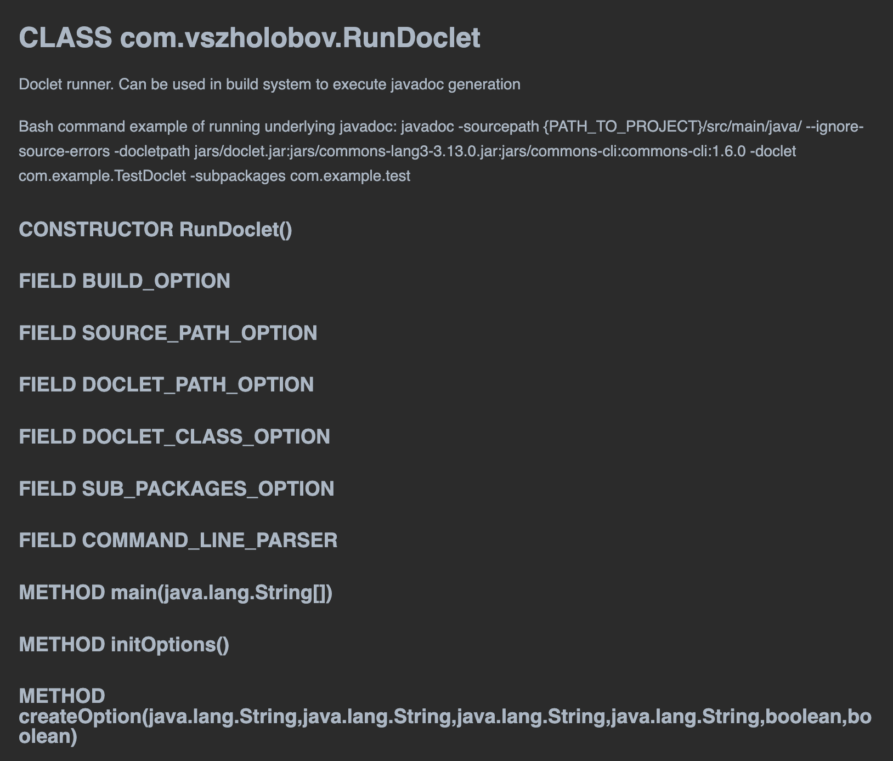

# MdDoclet

## Description
Project uses [Java Doclet Api](https://openjdk.org/groups/compiler/using-new-doclet.html) 
to generate javadoc-based documentation in MD format: [MdDoclet](src/main/java/com/vszholobov/MdDoclet.java)

Provides a startup class [RunDoclet](src/main/java/com/vszholobov/RunDoclet.java) 
for the ability to run a [MdDoclet](src/main/java/com/vszholobov/MdDoclet.java) from build systems

## Usage
### Maven
Maven command to generate this project documentation:
```
mvn clean compile assembly:single clean compile exec:java --debug --log-file doclet.logs
```

## Example
MD documentation output for [RunDoclet](src/main/java/com/vszholobov/RunDoclet.java) will be:
